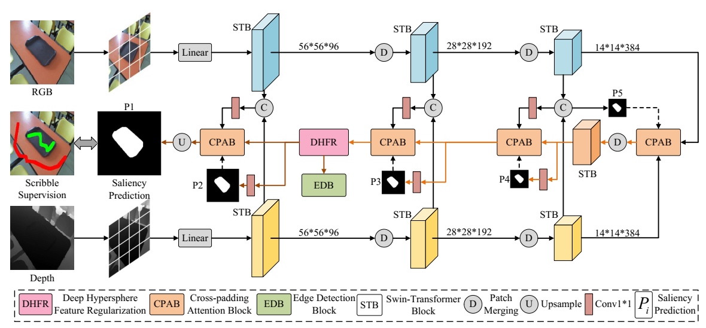
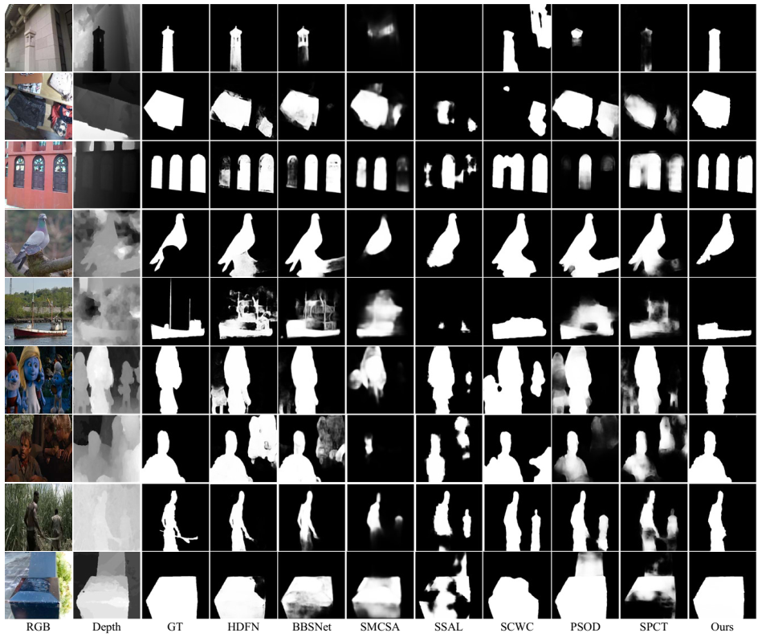

# Deep Hypersphere Feature Regularization for Weakly Supervised RGB-D Salient Object Detection
This is the code related to "Deep Hypersphere Feature Regularization for Weakly Supervised RGB-D Salient Object Detection" (IEEE TIP 2023)
<p align='center'>
  
</p>

## 1. Paper
[Deep Hypersphere Feature Regularization for Weakly Supervised RGB-D Salient Object Detection](https://ieeexplore.ieee.org/abstract/document/10268352)  
**IEEE Transactions on Image Processing (IEEE TIP)**

If you find it helpful to your research, please cite as follows:

```
@ARTICLE{10268352,
  author={Liu, Zhiyu and Hayat, Munawar and Yang, Hong and Peng, Duo and Lei, Yinjie},
  journal={IEEE Transactions on Image Processing}, 
  title={Deep Hypersphere Feature Regularization for Weakly Supervised RGB-D Salient Object Detection}, 
  year={2023},
  volume={32},
  number={},
  pages={5423-5437},
  keywords={Feature extraction;Semantics;Transformers;Object detection;Decoding;Annotations;Image edge detection;Salient object detection;weakly supervised learning;Deep Hypersphere Feature Regularization;Von Mises Fisher},
  doi={10.1109/TIP.2023.3318953}}
```

## 2. Preparation
* PyTorch 1.10.0
* CUDA 11.3
* Python 3.7.12
* Torchvision 0.8.2
* Download the model [**Google Cloud**](https://drive.google.com/file/d/11M6C4xWr_afAuLuNkY0FZkSMtatae6q-/view?usp=sharing) or [**Baidu Cloud**](https://pan.baidu.com/s/1XwlzTz8AhvCT-7XcOH6kaA?pwd=v9n2) pretrained on [**LocalViT**](https://github.com/ofsoundof/LocalViT). Put it into the folder "DHFR/snapshots/localvit/" named as "localvit_swin.pth".


## 3. Datasets
- Download datasets [**Google Cloud**](https://drive.google.com/file/d/1T8oMBb12cLPaIegwzxOnkp729FmRqug0/view?usp=sharing) or [**Baidu Cloud**](https://pan.baidu.com/s/1XwlzTz8AhvCT-7XcOH6kaA?pwd=v9n2), put it into folder "DHFR".

## 4. Usage
You can directly training the network within the following bash command.
```
./bashscripts/sod/train_sfnet_rgbd_scribble_sod.sh 0
```
where "0" denotes the GPU Id.

You can also use our trained model [**Google Cloud**](https://drive.google.com/file/d/1F7tjedI0mxuMDHCpWunQQjCQKXSPZLiM/view?usp=sharing) or [**Baidu Cloud**](https://pan.baidu.com/s/1XwlzTz8AhvCT-7XcOH6kaA?pwd=v9n2). When using this model, please place it in the folder "DHFR/snapshots/sod_scribble/rgbd_sod_sfnet_segsort/xxx/stage1" and rename it to "model-109249.pth", you can execute this command to obtain visualizations of features and scores for saliency detection.
```
./bashscripts/sod/train_sfnet_rgbd_scribble_sod_testscore.sh 0
```

## 5. Results
You can use the results as follows [**Google Cloud**](https://drive.google.com/file/d/1FQgkthgL54eaq7JRSS0TraPJkVWmycQI/view?usp=sharing) or [**Baidu Cloud**](https://pan.baidu.com/s/1XwlzTz8AhvCT-7XcOH6kaA?pwd=v9n2), the results include features visualizations and saliency detection scores.
<p align='center'>
  
</p>
